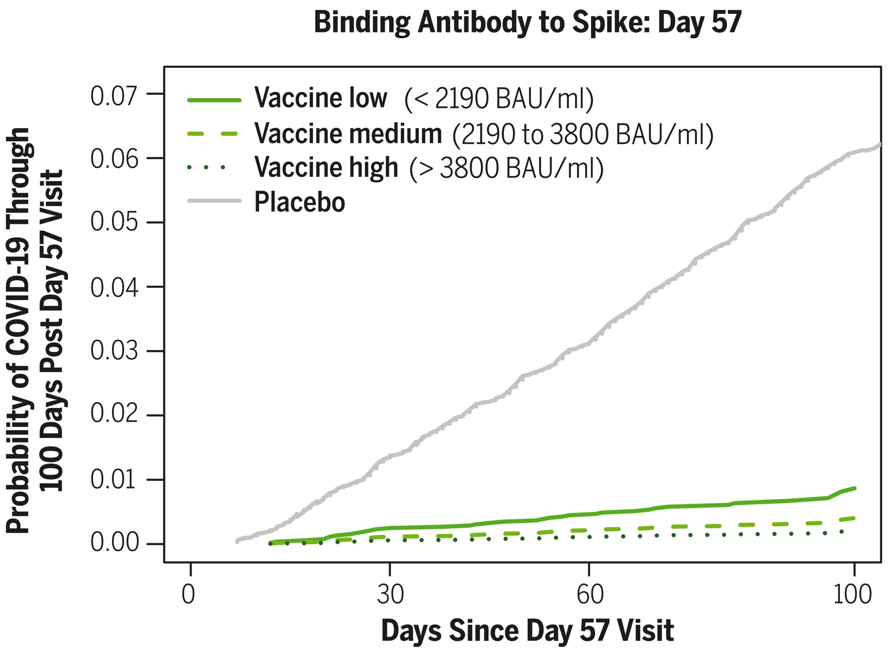
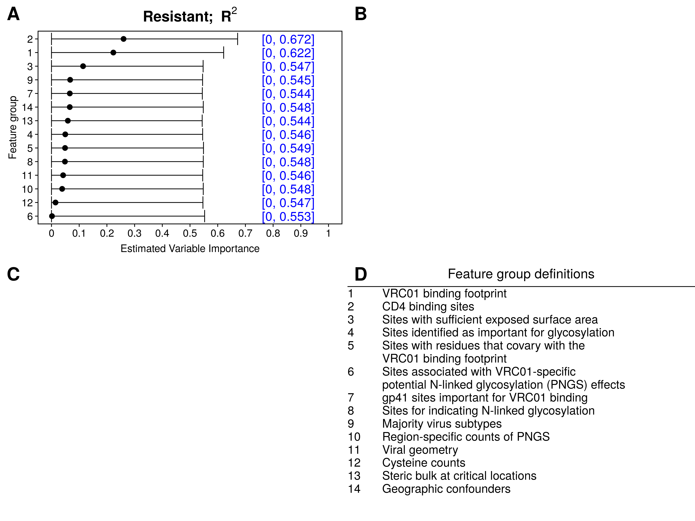

```{r xaringan-setup, include=FALSE, warning=FALSE}
library("xaringanthemer")

extra_css <- list(
  ".tiny" = list(`font-size` = "60%"),
  ".small" =  list(`font-size` = "80%"),
  ".large" =  list(`font-size` = "150%"),
  ".huge" =  list(`font-size` = "300%"),
  "ul li" = list(`margin-bottom` = "10px"),
  ".gray" = list(color = "#C0C0C0"),
  ".red" = list(color = "#FF0000"),
  ".green" = list(color = "#097969"),
  ".blue1" = list(color = "#3AABBE"),
  ".blue2" = list(color = "#2A6D90"),
  ".blue3" = list(color = "#446874"),
  ".purple" = list(color = "#624474"),
  ".mutedred" = list(color = "#745344"),
  "a" = list(color = "#3AABBE"),
  "a:hover" = list("text-decoration" = "underline")
)
# set up fonts
style_mono_accent(
  base_color = "#446874",
  header_font_google = google_font("DM Sans"),
  text_font_google   = google_font("DM Sans", "400", "400i"),
  code_font_google   = google_font("Courier Prime"),
  extra_css = extra_css
)

xaringanExtra::use_tile_view()
```

<style type="text/css">
.remark-slide-content {
    font-size: 20px
    header-h2-font-size: 1.75rem;
}
</style>

## Acknowledgments

The work I will present today was done in collaboration with:
```{r acknowledgments, echo = FALSE, fig.show = "hold", out.width = "65%", fig.align = "center"}
knitr::include_graphics(c(
    "img/people1.PNG"
  ))
```
```{r acknowledgments-2, echo = FALSE, fig.show = "hold", out.width = "65%", fig.align = "center"}
knitr::include_graphics(c(
    "img/people2.PNG"
  ))
```

---

## Motivation

.pull-left[


.small[ [Walls et al., 2020] ]
]

.pull-right[


.small[ [Gilbert et al., 2021] ]
]

---

## Motivation

```{r edrn, echo = FALSE, fig.show = "hold", out.width = "70%", fig.align = "center"}
knitr::include_graphics(c(
    "img/liu-etal_edrn.jpeg"
  ))
```
.small[ [Liu et al., 2020] ]

---

## Variable importance: what and why

**What is variable importance?**

--

* .blue1[Quantification of "contributions" of a variable] (or a set of variables)

  Traditionally: contribution to .blue2[predictions]
--

* Useful to distinguish between contributions of predictions...

  * (.blue1[extrinsic importance]) ... .blue1[by a given (possibly black-box) algorithm]
  .small[ [e.g., Breiman, (2001)] ]

  * (.blue1[intrinsic importance]) ... .blue1[by best possible (i.e., oracle) algorithm]
  .small[ [e.g., van der Laan (2006)] ]
--

* Our work focuses on .blue1[interpretable, model-agnostic intrinsic importance]

---

## Case study: ANOVA importance

Data unit $(X, Y) \sim P_0$ with:
* outcome $Y$ 
* covariate $X := (X_1, X_2, \ldots, X_p)$

--

**Goals:** 
* .green[estimate]
* .blue1[and do inference on]

the importance of $(X_j: j \in s)$ in predicting $Y$

--

How do we typically do this in **linear regression**?

---

## Case study: ANOVA importance

How do we typically do this in **linear regression**?

* Fit a linear regression of $Y$ on $X$ $\rightarrow \color{magenta}{\hat{\mu}(X)}$
--

* Fit a linear regression of $Y$ on $X_{-s}$ $\rightarrow \color{magenta}{\hat{\mu}_s(X)}$
--

* .green[Compare the fitted values] $[\hat{\mu}(X_i), \hat{\mu}_s(X_i)]$

--

Many ways to compare fitted values, including:
* ANOVA decomposition
* Difference in $R^2$

---

## Case study: ANOVA importance

Difference in $R^2$: $$\left[1 - \frac{n^{-1}\sum_{i=1}^n\{Y_i - \hat{\mu}(X_i)\}^2}{n^{-1}\sum_{i=1}^n\{Y_i - \overline{Y}_n\}^2}\right] - \left[1 - \frac{n^{-1}\sum_{i=1}^n\{Y_i - \hat{\mu}_s(X_i)\}^2}{n^{-1}\sum_{i=1}^n\{Y_i - \overline{Y}_n\}^2}\right]$$

--

&zwj;Inference:
* Test difference
* Valid confidence interval

---

## Case study: ANOVA importance

Consider the .blue1[population parameter] $$\psi_{0,s} = \frac{E_0\{\mu_0(X) - \mu_{0,s}(X)\}^2}{var_0(Y)}$$

* $\mu_0(x) := E_0(Y \mid X = x)$ .blue1[(true conditional mean)]
* $\mu_{0,s}(x) := E_0(Y \mid X_{-s} = x_{-s})$ 

  [for a vector $z$, $z_{-s}$ represents $(z_j: j \notin s)$]

--

* .blue2[nonparametric extension] of linear regression-based ANOVA parameter

--

* Can be expressed as a $\color{magenta}{\text{difference in population } R^2}$ values, since $$\color{magenta}{\psi_{0,s} = \left[1 - \frac{E_0\{Y - \mu_0(X)\}^2}{var_0(Y)}\right] - \left[1 - \frac{E_0\{Y - \mu_{0,s}(X)\}^2}{var_0(Y)}\right]}$$

---

## Case study: ANOVA importance

How should we make inference on $\psi_{0,s}$?
--

1. construct estimators $\mu_n$, $\mu_{n,s}$ of $\mu_0$ and $\mu_{0,s}$ (e.g., with machine learning)
--

2. plug in: $$\psi_{n,s} := \frac{\frac{1}{n}\sum_{i=1}^n \{\mu_n(X_i) - \mu_{n,s}(X_i)\}^2}{\frac{1}{n}\sum_{i=1}^n (Y_i - \overline{Y}_n)^2}$$
--

  but this estimator has .red[asymptotic bias]
--

3. using influence function-based debiasing [e.g., Pfanzagl (1982)], we get estimator $$\color{magenta}{\psi_{n,s}^* := \left[1 - \frac{\frac{1}{n}\sum_{i=1}^n\{Y_i - \mu_n(X_i)\}^2}{\frac{1}{n}\sum_{i=1}^n (Y_i - \overline{Y}_n)^2}\right] - \left[1 - \frac{\frac{1}{n}\sum_{i=1}^n\{Y_i - \mu_{n,s}(X_i)\}^2}{\frac{1}{n}\sum_{i=1}^n (Y_i - \overline{Y}_n)^2}\right]}$$

---

## Case study: ANOVA importance

$$\color{magenta}{\psi_{n,s}^* := \left[1 - \frac{\frac{1}{n}\sum_{i=1}^n\{Y_i - \mu_n(X_i)\}^2}{\frac{1}{n}\sum_{i=1}^n (Y_i - \overline{Y}_n)^2}\right] - \left[1 - \frac{\frac{1}{n}\sum_{i=1}^n\{Y_i - \mu_{n,s}(X_i)\}^2}{\frac{1}{n}\sum_{i=1}^n (Y_i - \overline{Y}_n)^2}\right]}$$

Key observations:
* $\psi_{n,s}^* =$ plug-in estimator of $\psi_{0,s}$ based on difference-in- $R^2$ representation
--

* .blue1[No need to debias] the difference-in- $R^2$ estimator!
--

* Why does this happen? 

  .blue2[Estimation of] $\mu_{0}$ .blue2[and] $\mu_{0,s}$ .blue2[yields only second-order terms, so estimator behaves as if they are **known**]
  
--

Under regularity conditions, $\psi_{n,s}^*$ is consistent and nonparametric efficient.

--

In particular, $\sqrt{n}(\psi_{n,s}^* - \psi_{0,s})$ has a mean-zero normal limit with estimable variance.

[Details in Williamson et al. (2020)]
---

## Preparing for AMP

```{r vrc01, echo = FALSE, out.width = "200px", fig.align = "center"}
knitr::include_graphics("img/amp.png")
```

* 611 HIV-1 pseudoviruses
* Outcome: neutralization sensitivity/resistance to antibody

--

**Goal:** pre-screen features for inclusion in secondary analysis
* 800 individual features, 13 groups of interest

--

&zwj;Procedure: 
1. Estimate $\mu_n$, $\mu_{n,s}$ using Super Learner [van der Laan et al. (2007)]
2. Estimate and do inference on variable importance $\psi_{n,s}^*$ 

.small[ [Details in Magaret et al. (2019) and Williamson et al. (2021b)] ]

---

## Preparing for AMP: R-squared

```{r vrc01-r2, echo = FALSE, out.height="480px", fig.align="center"}

```

---

## Generalization to arbitrary measures

ANOVA example suggests a natural generalization:
--

* Choose a relevant measure of .blue1[predictiveness] for the task at hand

--

  * $V(f, P) =$ .blue1[predictiveness] of function $f$ under sampling from $P$
  * $\mathcal{F} =$ rich class of candidate prediction functions
  * $\mathcal{F}_{-s} =$ {all functions in $\mathcal{F}$ that ignore components with index in $s$} $\subset \mathcal{F}$
  
--

* Define the oracle prediction functions

  $f_0:=$ maximizer of $V(f, P_0)$ over $\mathcal{F}$ & $f_{0,s}:=$ maximizer of $V(f, P_0)$ over $\mathcal{F}_{-s}$

--

Define the importance of $(X_j: j \in s)$ relative to $X$ as $$\color{magenta}{\psi_{0,s} := V(f_0, P_0) - V(f_{0,s}, P_0) \geq 0}$$

---

## Generalization to arbitrary measures

Some examples of predictiveness measures:

(arbitrary outcomes)

&zwj; $R^2$: $V(f, P) = 1 - E_P\{Y - f(X)\}^2 / var_P(Y)$

--

(binary outcomes)

Classification accuracy: $V(f, P) = P\{Y = f(X)\}$

&zwj;AUC: $V(f, P) = P\{f(X_1) < f(X_2) \mid Y_1 = 0, Y_2 = 1\}$ for $(X_1, Y_1) \perp (X_2, Y_2)$

Pseudo- $R^2$ : $1 - \frac{E_P[Y \log f(X) - (1 - Y)\log \{1 - f(X)\}]}{P(Y = 1)\log P(Y = 1) + P(Y = 0)\log P(Y = 0)}$

---

## Generalization to arbitrary measures

How should we make inference on $\psi_{0,s}$?
--

1. construct estimators $f_n$, $f_{n,s}$ of $f_0$ and $f_{0,s}$ (e.g., with machine learning)
--

2. plug in: $$\psi_{n,s}^* := V(f_n, P_n) - V(f_{n,s}, P_n)$$
  
  where $P_n$ is the empirical distribution based on the available data
--

3. Inference can be carried out using influence functions.
--
 Why?

We can write $V(f_n, P_n) - V(f_{0}, P_0) \approx \color{green}{V(f_0, P_n) - V(f_0, P_0)} + \color{blue}{V(f_n, P_0) - V(f_0, P_0)}$

* the $\color{green}{\text{green term}}$ can be studied using the functional delta method
* the $\color{blue}{\text{blue term}}$ is second-order because $f_0$ maximizes $V$ over $\mathcal{F}$

--

In other words: $f_0$ and $f_{0,s}$ **can be treated as known** in studying behavior of $\psi_{n,s}^*$!

[Details in Williamson et al. (2021b)]

---

## Preparing for AMP: the full picture

```{r vrc01-r2-acc-auc, echo = FALSE, out.height="480px", fig.align="center"}
knitr::include_graphics("img/vim_ic50.censored_pres_r2_acc_auc_conditional_simple.png")
```

---

## Preparing for AMP: the full picture

&zwj;Implications:
--

* All sites in the VRC01 binding footprint, CD4 binding sites appear important
--

* Results may differ based on chosen measure

--

Other applications:
  * combination regimens against HIV-1 [Williamson et al., 2021a]
  * COVID-19 prevention (forthcoming)

---

## Extension: correlated features

So far: importance of $(X_j: j \in s)$ relative to $X$

--

$\color{red}{\text{Potential issue}}$: correlated features

&zwj;Example: two highly correlated features, age and foot size; predicting toddlers' reading ability

--

* True importance of age = 0 (since foot size is in the model)
* True importance of foot size = 0 (since age is in the model)

--

&zwj;Idea: average contribution of a feature over all subsets!

--

True importance of age = average(.blue1[increase in predictiveness from adding age to foot size] & .green[increase in predictiveness from using age over nothing])

---

## Extension: correlated features

Specifically, for each $j \in \{1, \ldots, p\}$, we define the SPVIM

$$\psi_{0,j} := \sum_{s \in \{1, \ldots, p\}\setminus \{j\}} \binom{p - 1}{\lvert s \rvert}^{-1}\frac{1}{p}\{V(f_{0,s\cup j}, P_0) - V(f_{0,s},P_0)\}$$ 

.small[ (SPVIM = Shapley Population Variable Importance Measure) ]

--

Estimation procedure: based on .blue1[sampling a fraction] $c$ of all possible subsets

--

.green[Inference] can be carried out using influence functions, as before

.small[ [Details in Williamson and Feng (2020)] ]

---

## Flexible variable selection

&zwj;Goal: develop a biomarker panel for classifying pancreatic cysts

--

Complicating factors:
* .red[missing data] due to limited specimen volumes
* desire for .green[parsimonious] set of biomarkers

--

&zwj;Solution: variable selection

--

Useful to distinguish between variable selection...

--

* ... .blue1[to increase prediction performance] .small[ (e.g., Tibshirani (1996)) ]
* ... .blue2[to find scientifically relevant variables] .small[ (e.g., Barber and Candes (2015)) ]

--

Our work focuses on the latter, in contexts where
* a (generalized) linear model may be .red[misspecified]
* there may be complex missing data

--

&zwj;Idea: use .green[variable importance]!

---

## Flexible variable selection

The SPVIM

$$\psi_{0,j} := \sum_{s \in \{1, \ldots, p\}\setminus \{j\}} \binom{p - 1}{\lvert s \rvert}^{-1}\frac{1}{p}\{V(f_{0,s\cup j}, P_0) - V(f_{0,s},P_0)\}$$ 

suggests a natural dichotomy:

--

* if $\psi_{0,j} > 0$, $X_j$ has .blue1[some] utility when added to .blue1[a subset]

--

* if $\psi_{0,j} = 0$, $X_j$ has .red[no] utility when added to .red[any subset]

--

So we can use .blue1[intrinsic importance] to do flexible variable selection!

---

## Flexible variable selection

How can we select variables based on $\psi_{0,j}$?

--

1. Estimate $\psi_0 = \{\psi_{0,j}\}_{j=1}^p$, obtain p-values $p_{n,j}$ for each test of zero importance

--

3. Compute .blue1[adjusted] p-values $\tilde{p}_{n,j}$ to control the .blue2[family-wise error rate] (FWER)

--

4. Set $S_n(\alpha) = \{j \in \{1, \ldots, p\}: \tilde{p}_{n,j} < \alpha\}$

--

5. For $k \in \{0, \ldots, p - \lvert S_n(\alpha)\rvert\}$, determine .blue1[augmentation set] 
$$A_n(k, \alpha) = \{s \subseteq S_n^c(\alpha): \tilde{p}_{n,\ell} \leq \tilde{p}_{n,(k)} \text{ for all } \ell \in s\}$$ 
  
  (if $k = 0$, $A_n(k, \alpha) = \emptyset$)

--

6. Final set of selected variables: $S_n^+(k, \alpha) = S_n(\alpha) \cup A_n(k, \alpha)$

---

## Flexible variable selection

The .blue1[augmentation set] allows for error control using a tuning parameter $k \in \{0, \ldots, p - \lvert S_n(\alpha)\rvert\}$

--

Examples of more general error rates: 

* .blue2[generalized FWER]: probability of making more than $k + 1$ type I errors

* .blue2[proportion of false positives] among the rejected variables greater than $q(k) \in (0, 1)$

* .blue2[false discovery rate]

--

$k$ can be determined to .blue1[control one of these error rates]! 

And the resulting procedure is .blue1[persistant]

.small[ [Details in Williamson and Huang (2022)] ]

---

## Flexible variable selection

How can we select variables based on $\psi_{0,j}$ with missing data? 

--

1. Multiply impute the data

--

2. Estimate $\psi_0$ on each imputed dataset

--

3. Use Rubin's rules: combine estimates, standard errors; obtain p-values

--

4. Proceed as with complete data

---

## Numerical results

Selection procedures:
* lasso 
  * lasso + stability selection .small[ [Meinshausen and Buhlmann (2010)] ] 
  * lasso + knockoffs .small[ [Barber and Candes (2015)] ]

--

* intrinsic selection (SPVIM with augmentation)

--

Two settings: (binary outcome, continuous features, varying missing data)
* linear outcome-feature relationship (setting 1)
  * 6 important features (some very important, some weakly important)
  * $p \in \{30, 500\}$

--

* nonlinear outcome-feature relationship, correlated features (setting 1)
  * 3 important features (all equally weakly important)
  * $p = 6$
  
---

## Numerical results: setting 1

```{r results-a-auc, echo = FALSE, fig.show = "hold", out.width = "100%", fig.align = "center"}
knitr::include_graphics(c(
    "img/binomial-probit-linear-normal-nested_talks-auc.png"
  ))
```

---

## Numerical results: setting 1

```{r results-a-sens-spec, echo = FALSE, fig.show = "hold", out.width = "100%", fig.align = "center"}
knitr::include_graphics(c(
    "img/binomial-probit-linear-normal-nested_talks-sens-spec.png"
  ))
```

---


## Numerical results: setting 2

```{r results-b-auc, echo = FALSE, fig.show = "hold", out.width = "100%", fig.align = "center"}
knitr::include_graphics(c(
    "img/nonlinear-normal-correlated_talks-auc.png"
  ))
```

---

## Numerical results: setting 2

```{r results-b-sens-spec, echo = FALSE, fig.show = "hold", out.width = "100%", fig.align = "center"}
knitr::include_graphics(c(
    "img/nonlinear-normal-correlated_talks-sens-spec.png"
  ))
```

---


## Classifying pancreatic cysts

Cross-validated AUC of each procedure for selecting sets:
```{r data-results, echo = FALSE, fig.show = "hold", out.width = "100%", fig.align = "center"}
knitr::include_graphics(c(
    "img/data-analysis_v2.png"
  ))
```

---

## Current and future directions

Several extensions:
* .green[Longitudinal] variable importance
* A measure for .blue1[tailoring variables]
* .blue2[Fairness-aware] variable importance

```{r acknowledgments-3, echo = FALSE, fig.show = "hold", out.width = "55%", fig.align = "center"}
knitr::include_graphics(c(
    "img/people3.png"
  ))
```
---


## Closing thoughts

.blue1[Population-based] variable importance:
* wide variety of meaningful measures
* simple estimators
* machine learning okay
* valid inference, testing
* can be used for variable selection
  * offers protection against model misspecification
  * missing data handled naturally

Check out the software:

* R packages [`vimp`](https://github.com/bdwilliamson/vimp) (importance) and [`flevr`](https://github.com/bdwilliamson/flevr) (selection)
* Python package [`vimpy`](https://github.com/bdwilliamson/vimpy) (importance)

`r icons::fontawesome('github')` https://github.com/bdwilliamson | `r icons::fontawesome('globe')` https://bdwilliamson.github.io

---

## References

* .small[ Barber RF and Candes EJ. 2015. Controlling the false discovery rate via knockoffs. _Annals of Statistics_.]
* .small[ Breiman L. 2001. Random forests. _Machine Learning_.]
* .small[ Gilbert PB et al. 2021. Immune correlates analysis of the mRNA-1273 COVID-19 vaccine efficacy clinical trial. _Science_.]
* .small[Liu Y et al. 2020. Biomarkers and strategy to detect preinvasive and early pancreatic cancer: state of the field and the impact of the EDRN. _Cancer Epidemiology, Biomarkers & Prevention_.]
* .small[ Magaret CA, Benkeser DC, Williamson BD, et al. 2019. Prediction of VRC01 neutralization sensitivity by HIV-1 gp160 sequence features. _PLoS Computational Biology_. ]
* .small[ Meinshausen N and Buhlmann P. 2010. Stability selection. _Journal of the Royal Statistical Society: Series B (Methodological)_. ]
* .small[ Tibshirani R. 1996. Regression shrinkage and selection via the lasso. _Journal of the Royal Statistical Society: Series B (Methodological)_. ]
* .small[ van der Laan MJ. 2006. Statistical inference for variable importance. _The International Journal of Biostatistics_.]

---

## References

* .small[ van der Laan MJ, Polley EC, and Hubbard AE. 2007. Super Learner. _Statistical Applications in Genetics and Molecular Biology_. ]
.small[ Walls AC et al. 2020. Structure, function, and antigenicity of the SARS-CoV-2 Spike glycoprotein. _Cell_.]
* .small[ Williamson BD, Magaret CA, Gilbert PB, Nizam S, Simmons C, and Benkeser DC. 2021a. Super LeArner Prediction of NAb Panels (SLAPNAP): a containerized tool for predicting combination monoclonal broadly neutralizing antibody sensitivity. _Bioinformatics_.]
* .small[ Williamson BD, Gilbert P, Carone M, and Simon N. 2020. Nonparametric variable importance assessment using machine learning techniques (+ rejoinder to discussion). _Biometrics_. ]
* .small[ Williamson BD, Gilbert P, Simon N, and Carone M. 2021b. A general framework for inference on algorithm-agnostic variable importance. _Journal of the American Statistical Association_. ]
* .small[ Williamson BD and Feng J. 2020. Efficient nonparametric statistical inference on population feature importance using Shapley values. _ICML_. ]
* .small[ Williamson BD and Huang Y. 2022. Flexible variable selection in the presence of missing data. _arXiv_.]
